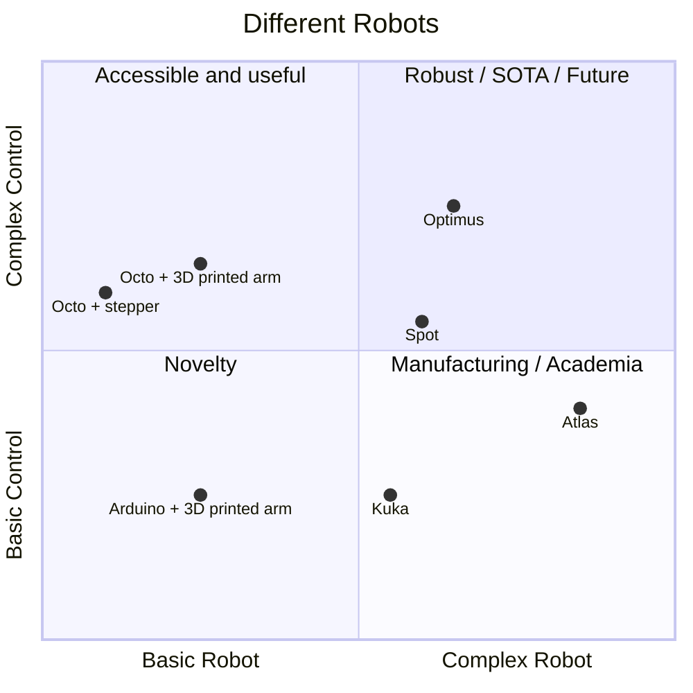
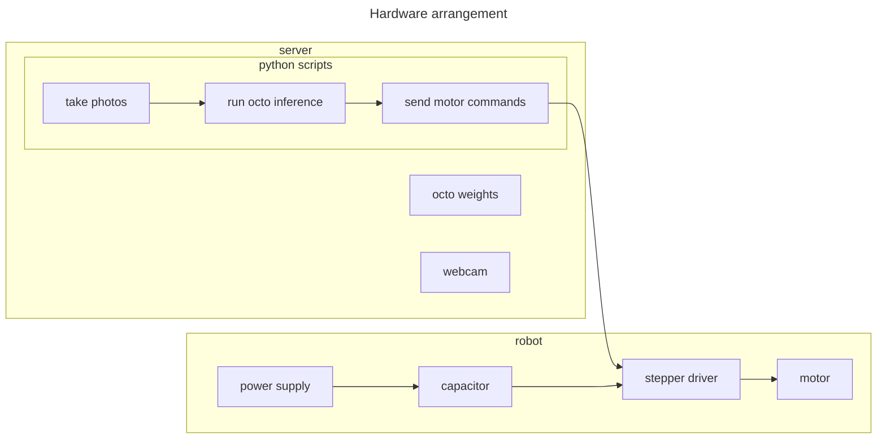
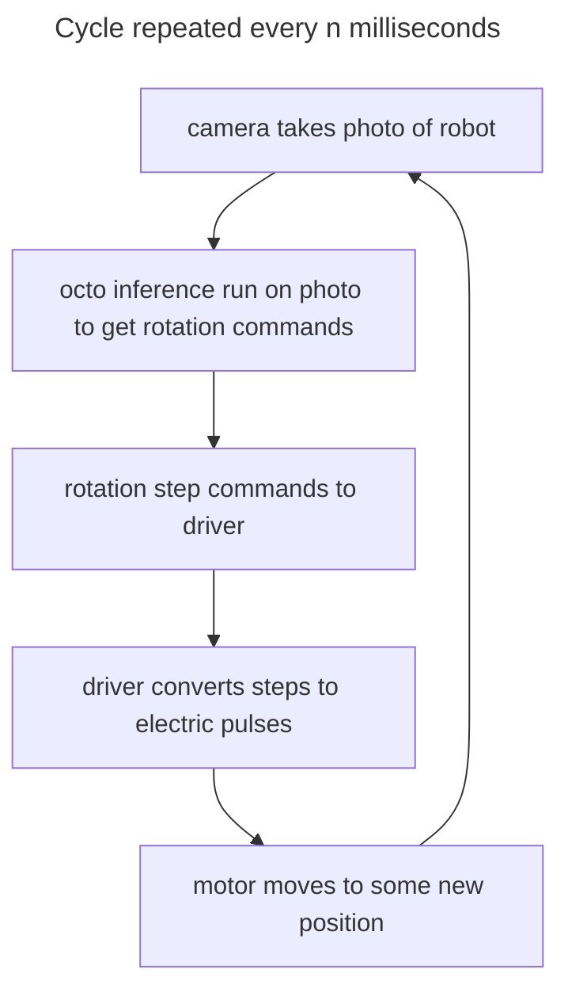

# scrimp-bot
Make a bot from what you've got

# Scrimp Bot

A cheap but useable arm made from convenient parts.

  - [Goal](#goal)
  - [Rationale](#rationale)
  - [Roller screw technology](#roller-screw-technology)
  - [Parts list](#parts-list)
  - [Simple form](#simple-form)
  - [Scrimp friendly](#scrimp-friendly)
  - [How control works](#how-control-works)
  - [How the muscle works](#how-the-muscle-works)
  - [Gearing](#gearing)
  - [Muscle module force](#muscle-module-force)
  - [Arm torque](#arm-torque)
  - [Telescopic design](#telescopic-design)
  - [Stepper and driver](#stepper-and-driver)
  - [Findings](#findings)
  - [Improvements](#improvements)
  - [Brains](#brains)


## Goal

For about 100 USD, build an arm that can lift regular objects around in a normal regular working space.

## Rationale

Robotic foundation models will soon make smooth control of rickety robots trivial.

One must have a robot to try them out. Scrimp bot is made from cheap parts a 3D printing hobbyist may already have
(filament, stepper motors, M3 bolts).

Words in -> vision-movement 2Hz looping -> smooth task completion

By mounting webcams on the robot, a script that takes images at 2Hz can feed the images containing
the robot position and environment to a model. The model puts out instructions to send to the robot. This implies that fine control will be possible, even if
the robot is not ultraprecise. Humans cannot do things precisely with their eyes closed, and neither can scrimp bot.

Scrimp bot is manually controllable with a few potentiometers. That allows
some training data to be made. A model fine tuned on those episodes can later
be used instead of the manual controller.




## Roller screw technology

The main moving part in scrimpbot is the inverted planetary roller screw.

Its just a screw, but with low friction. That's good for robotics because
you don't want to lose any energy. Screws are nice because they can push heavy loads and you can tune them to make them stronger or faster.

If you want to explore this mechanism, consider printing this vise I designed and having a play. The roller screw there is the same that is used in scrimp bot.

[https://github.com/ceramic-sf/vice-vise/tree/main](https://github.com/ceramic-sf/vice-vise/tree/main)

## Parts list

One may have most of these around the house.

| Item                          | Units | USD/unit | USD total | Mass/Unit (g) | Mass total (g) |
|-------------------------------|-------|----------|-----------|---------------|----------------|
| PLA 1kg                       | 2     | 25       | 50        | 1000          | 2000           |
| NEMA 17 stepper motor         | 5     | 5        | 25        | 300           | 1500           |
| M3 bolts/nuts 300pcs          | 2     | 8        | 16        | 100           | 200            |
| Webcam 340p                   | 3     | 5        | 15        | 30            | 90             |
| TMC2208 drivers               | 5     | 2        | 10        | 5             | 25             |
| Super glue tube               | 3     | 2        | 6         | 1             | 3              |
| Wire 1m                       | 10    | 0.5      | 5         | 10            | 100            |
| Wood 2x4 1m                   | 1     | 5        | 5         | 1500          | 1500           |
| Variable resistors            | 5     | 1        | 5         | 3             | 15             |
| Arduino                       | 1     | 5        | 5         | 25            | 25             |
| Power supply 24V 5A           | 1     | 5        | 5         | 200           | 200            |
| Electrolytic Capacitor 100uF  | 1     | 1        | 1         | 1             | 1              |
| Rubber bands                  | 10    | 0.1      | 1         | 0.1           | 1              |
| **TOTALS**                    |       |          | **170**   |               | **5660**       |

## Simple form

A mechanical muscle module that can lengthen and contract. Make multiple muscles to "flesh out" a robot skeleton.

The skeleton is wooden with some ball and socket joints.
Two muscles acting together can make a single joint roll, pitch and yaw. Multiple
joints allows for a large range of motion, similar to that of a human arm.

## Scrimp friendly

The muscle module can fit any stepper size and length you have. The
FreeCAD model uses paramater based design and updating stepper sizes in the
CAD spreadsheet updates the physical model.

## How control works

Electronics go in a 3D printed box with some sliders that act as a remote control.

The human looks at the arm and moves the resistors, one per muscle.
Each resistor is read by the arduino and converts position into a velocity.
The signal is sent to the stepper driver, which sends signals to the stepper. The stepper spins
the roller screw, which changes the muscle length. The arm moves. One muscle operates a crab claw.

Theoretically, the control box can be removed and the webcams turned on. Then
one would type instructions on a laptop, and a robot foundation model would move scrimbot

## How the muscle works

Stepper motors are high torque with low speed. A 34mm NEMA17 can get about 3 rotations per second
(180RPM). If applied to a screw system with a lead of 5-15mm/rotation that can result in a linear movement of
15-45mm/sec. This linear movement is the same as the linear movement of a contractile muscle, simply fix it to a bone either side of a joint.

## Gearing

A roller screw is useful in transmitting work efficiently (80-90%). The screw can be designed
to have higher speed or higher torque. This allows the mechanical advantage to be tuned
easily.

For a better understanding of how this works, try out this
[roller screw recipe](https://github.com/ceramic-sf/vice-vise/blob/main/roller_screw_recipe.md).

Additionally, the where the muscle is attached and how long the limb is can be modified
for higher speed or higher torque.

## Muscle module force

The stepper motor performs work during a full revolution. That work
is equal to the work done by the muscle module which exterts a constant force
over the lead of the roller screw.

Let's calculate the force. We know what torque the stepper exerts (datasheet). We
know that the force exterted will be different if the lead is high (low torque) or
low (high torque).

Mechanically this is the same as a rack (screw) and pinion (stepper). The pinion
gear turns one revolution and the rack moves one lead distance. So the pinion circumference is equal to the screw lead. That lets us calculate the radius of the
pinion, which is where the force is being exterted on the rack.
```
stepper_torque_nm = force_exterted_n * pinion_radius_meters
force_exerted_n = stepper_torque_nm / pinion_radius_meters
```
Where:
```
circumference_pinion_meters = roller_screw_lead_meters
```
Replace circumference with radius and rearrange:
```
pinion_radius_meters = roller_screw_lead_meters / 2 * pi
```
So, the newtown force for a given newton meter torque input of a stepper motor
driven roller screw is:
```
force_exerted_n = 2 * pi * stepper_torque_nm / roller_screw_lead_meters
```

Leads are usually in millimeters and stepper datasheets often have kgcm torque. Where:
```
stepper_torque_nm = stepper_torque_kgcm * g_gravity / 100
```
The useful formula is:

```
force_exerted_n = 20 * pi * g_gravity * stepper_torque_kgcm / roller_screw_lead_millieters
```
Simplified:
```
force_exerted_n ~= 630 * stepper_torque_kgcm  / roller_screw_lead_millimeters
```
However, transmission of a roller screw is not perfect (80-90% efficient).
Using 80% efficiency:
```
force_exerted_real_n = 500 * stepper_torque_kgcm / roller_screw_lead_millimeters
```
Which for a cheap step stepper with 1.3kgcm torque and a lead of 10mm results
in a torque of ~65N.

## Arm torque

The stepper motor has torque that drives the screw, which exterts a constant push or pull force. That force is applied on the moving bone of a skeleton, some distance from the joint.

We can attach the muscle module to work as a first-class (seesaw, tricep muscle) or a second-class  (wheelbarrow, bicep muscle) lever. A first class keeps the
muscles more out of the way.

So the muscle attaches on one side of the joint (`attached_distance_m`) and
moves the arm (`arm_length_m`).

The largest mass that can be lifted by an arm with a single muscle motor module can be calculated. Let the muscle torque and the lifting torque be equal:

```
muscle_module_force * attached_distance_m = kg_liftable * g_gravity * arm_length_m
```
So max `kg_liftable`:
```
kg_liftable = muscle_module_force * attached_distance_m / (g_gravity * arm_length_m)
```

We now use the muscle module force calculation from before:
```
kg_liftable = 50 * stepper_torque_kgcm * attached_distance_m / (arm_length_m * roller_screw_lead_millimeters)
```

So if we use a standard NEMA17, a 10mm lead, connect the muscle 10cm from the joint and have the arm be 40cm long then the liftable mass is 1.6kg.

The actual prototype has a 4mm lead, muscle connected at 10cm, and a 30cm arm. So the liftable mass is 5.4kg. Two muscles are used, which gives ~10kg liftable mass in theory. Some of that mass will be lifting the outer parts of the arm (wrist and claw motors and parts).

## Telescopic design

In this design, the stepper motor is integrated with the inverted planetary roller screw to form a plug and play
motor muscle module.

The main features of this design are:
- The stepper motor is protected from axial loads via a printed slew bearing
- The stepper motor telescopes into the nut of the roller screw which reduces the length of the
muscle module.

An inverted planetary roller screw facilitates the teslescope action, where a non-inverted
would not.


## Stepper and driver

Old discarded NEMA17 steppers:
- Model: KH42HM2B017
- Coil: 30ohms/phase
- Current: 0.82A/phase
- Rated holding torque: 1.3kgcm
- Axial housing length: 34mm

Driver:
- Model: TMC2208 (the stepper is nearly silent with this driver)
- Mode: Half step (reduces torque, but full step requires sending driver signals in a more complicated way)
- Current limit: 0.54A
    - `reference_voltage = max_current * 1.41 = 1.0V`
    - Initially 0.8A was used (stepper datasheet), but was too hot.


## Findings

It works, but some mods are in order.

| Feature                              | Problem                                                                                       | Suggestion                                                          |
|--------------------------------------|-----------------------------------------------------------------------------------------------|---------------------------------------------------------------------|
|Muscle modules|Large diameter means they rub|Stop telescoping stepper into nut.|
| Stepper Motor Telescoping            | Stepper motor makes the nut large and modules rub | Place stepper next to nut and drive the nut |
| Stepper Motor Telescoping            | Roller screw cannot be sealed for noise and lubrication | Keep stepper out of nut, seal mechanism |
| Thread Starts                        | One thread start makes the screw structurally vulnerable.                                     | Use 2 or 3 thread starts to improve structural integrity.           |
| Motors always on                    | Motors reach around 70 degrees, causing PLA to glass.            | Turn off current when not moving. |
| Bearings                             | Bearings add friction and may be unnecessary as PLA would break first.                        | Remove bearings and let stepper take axial load.        |
| Stepper Motor Installation           | Stepper motor is fiddly to install.                                                           | Use a face plate for easier installation and removal.               |
| Stepper Motor Shaft                  | No grip for the grub screw.                                     | Grind the shaft to a "D" shape for better grub screw grip.          |
| Lift Capacity and Speed              | Lift capacity is good, but movement is slow.                                                  | Use longer stepper motors and higher lead roller screws.            |
| Ball and Socket Joints               | Joints work well but had a dislocation.                                                       | Reinforce socket or redesign joints.                         |
| Tendon-Based Attachments             | Tendon-based attachments need supports to print                                                  | Separate tendons fromo joints |
| Stepper Motor Enclosure              | Enclosure obstructs heat dissipation, potentially causing PLA to melt.                        | Design the enclosure to improve heat dissipation.                   |
| Noise Level                          | Mechanism is moderately noisy.                                                                | Seal and lubricate the mechanism to reduce noise.                   |


## Improvements


A next iteration of scrimp bot given the above findings Given the above direction is:
- Reduce complexity
- Remove features

New design:
- Stepper bolted to a hinge
- Stepper shaft bolted to end of nut
- Muscle motor modules will have smaller radius
- Roller screw mechanism stays inside nut
- A cental screw extension rod is bolted to a joint

## Brains

Scrimpbot can theoretically be driven by a robotic foundation model.

See [scrimp bot brains](./scrimp_bot_brains.md) for a work-in-progress walkthrough of the most straightforward path I can see being feasible.

The hardware roughly looks like this:


The software mainly does this:
