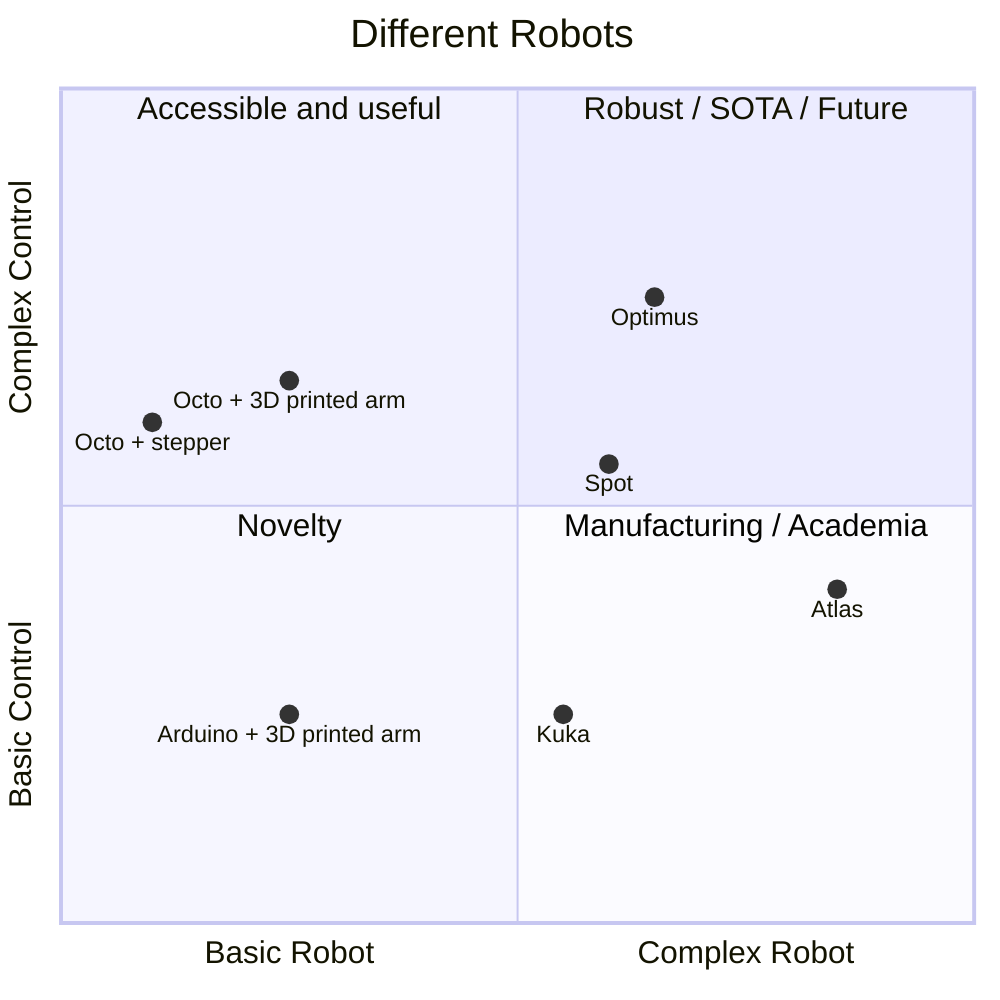
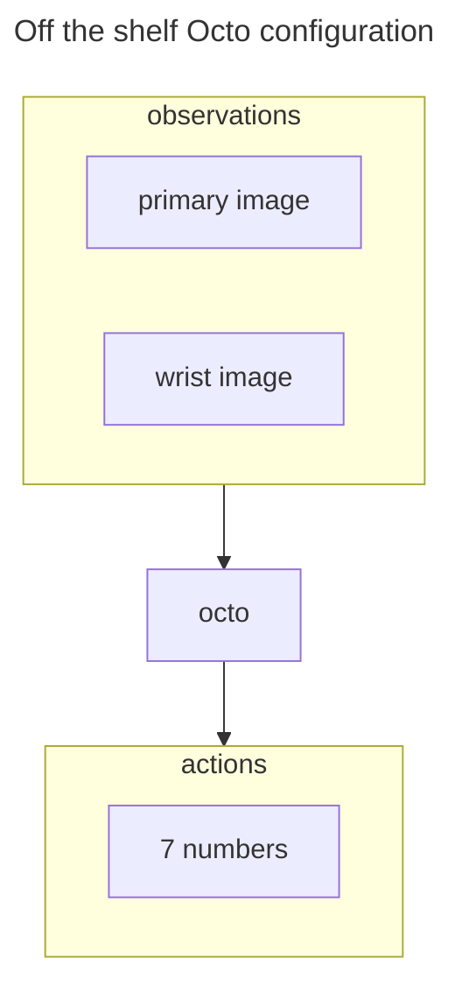
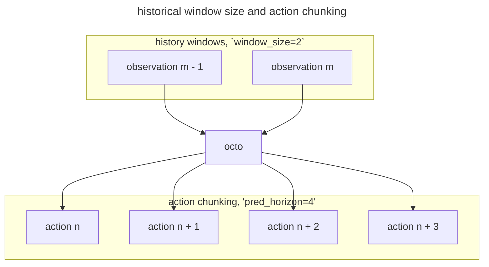
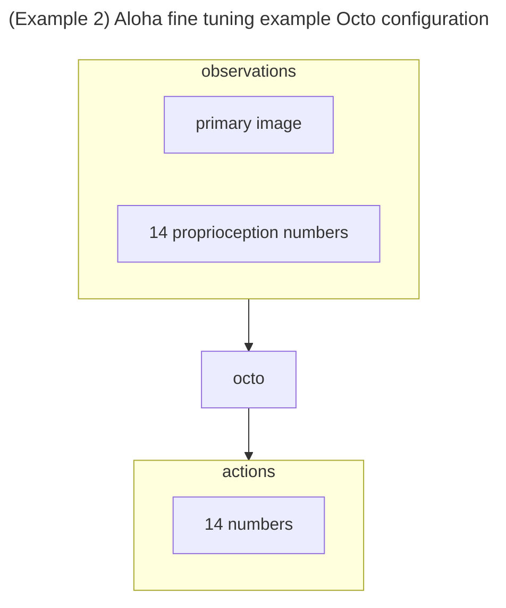
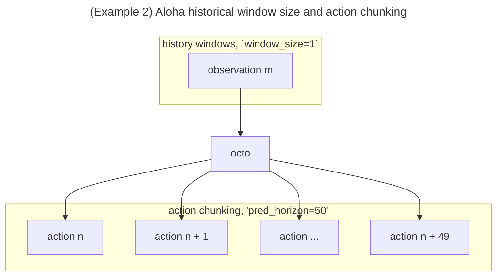
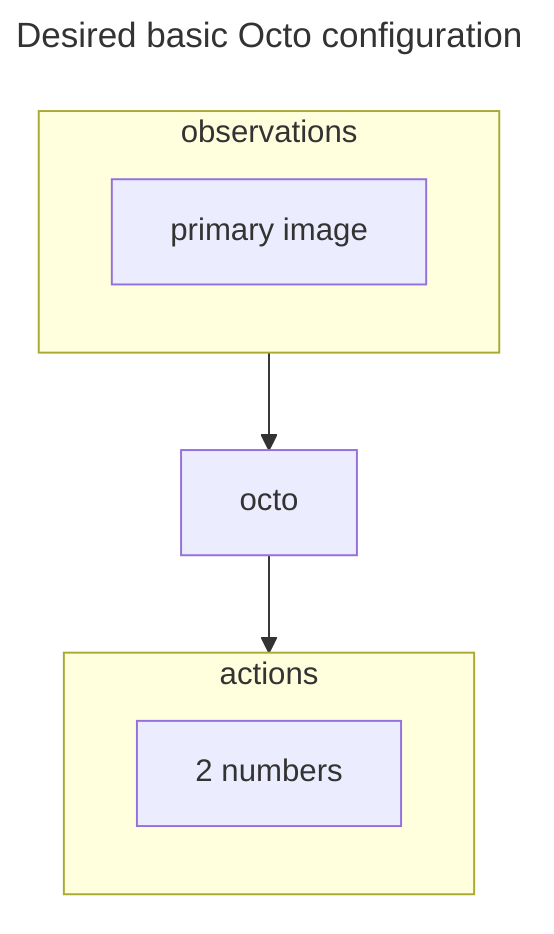
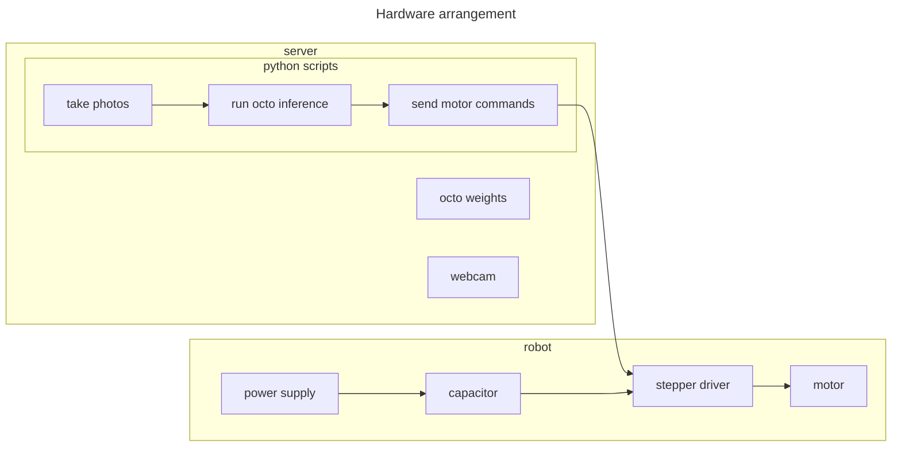
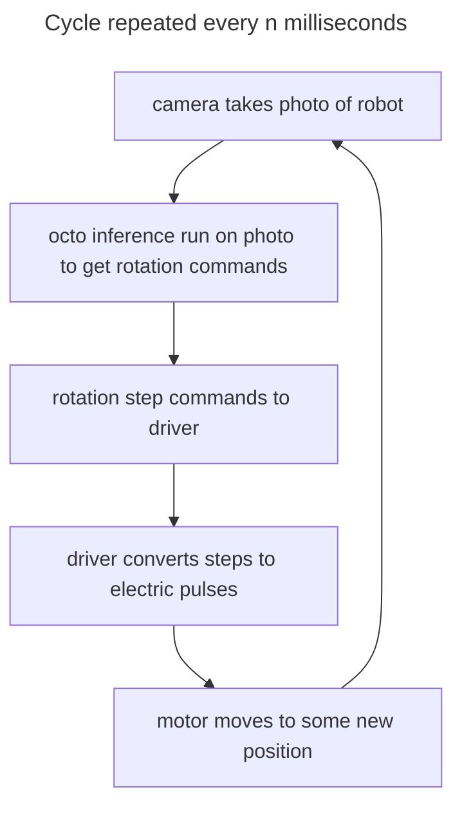

# scrimp bot box

How to use Engligh sentences to control a home made robot.

"Grab to the banana"

Status: Ideas/research phase.

Progress: Search for the "🚧 progress marker 🚧" below.

## Introduction

An exploration of the Octo robot control model ([https://github.com/octo-models/octo](https://github.com/octo-models/octo)) running on a dedicated box connected to a cheap
homemade robot.

Octo uses images of the robot to work out what the robot should do. Cheap webcams are attached
to the robot, the cameras can see part of the robot and part of the environment.
Cameras are the only positional feedback that the robot has.

## Server setup

An i5 without is used without a dedicated GPU. Webcams and arduino are
plugged in over USB.

- Download ubuntu, burn to usb, install on pc, configure, SSH in from laptop

## Robot hardware setup

Build a robot that can be controlled by an arduino.

- Construct parts, add motors, connect drivers to motors, connect arduino to drivers.

## Robot software setup

Create a python script that can send data to the arduino via serial interface.

## Using octo to move the robot

Scrimp bot is a single stepper motor in front of a camera that can point
to objects drawn on a clockface. It is controlled by text input to a vision-enabled transformer that outputs
rotation commands.

scrimp bot is interesting because you can keep adding motors and
sensors and make incremental progress to more accessible and useful
robotics.


Octo accepts language commands and sensor input and outputs commands for a robot controller to follow.

This is interesting because you can give a complicated command like "point to the cat"
and the model will watch as progress unfolds and update commands on the fly.

One can imagine a robot with only cameras for sensors and direct motor control. This walkthrough
attempts that with a single stepper motor with a camera pointed at it. The motor can rotate to
point at different pictures. An instruction "point to the cat" can be given, the model
is regularly fed camera frames of the motor, the model outputs rotation commands, and the commands
are sent by a microcontroller to the motor.

First we will try with the model as it is published, which would be an environment the model
has never seen and may not work well. Then we can fine tune the model by recording episodes
manually and then storing them in a particular format and fine tuning the model.

If the basic test works, it will be easy to add more motors and cameras. At that point we would
have a robot arm that only relies on sight for control, and it would be good to see if complex and
precise tasks could be performed. From there, one could make a two handed robot and see if that
works. Sensors can also be added as inputs. At this point, one could have a low cost
robot arm setup that can respond to human language.


### Observations
We can see that the model will accept a primary image and/or a wrist image.
We have only passed a primary image (supposed to be a main image of the robot,
but we used a dummy image).

These are all things that we can redefine when fine tuning the model later.
So a robot may have 3 images from different angles, and no wrist image. Or
it may have only one image and several force sensors.
```console
Observations: {
    image_primary: ('batch', 'history_window', 256, 256, 3),
    image_wrist: ('batch', 'history_window', 128, 128, 3),
}
```
### Tasks
We sent a text task, but we could have also sent a target image. That
is, an ideal end point that the robot should look like once it is finished,
either from zoomed out, or from the wrist perspective.
```console
Tasks: {
    image_primary: ('batch', 256, 256, 3),
    image_wrist: ('batch', 128, 128, 3),
    language_instruction: {
        attention_mask: ('batch', 16),
        input_ids: ('batch', 16),
    },
}
```
### Actions
Then we see actions the model thinks are appropriate.

The model produces 7 actions, 4 steps into the future. We can that there are
4 sets of seven action values in the output:
```console

'pick up the fork' actions:
[[[ 0.69299155  0.19062363 -0.05662455  0.18763681  0.07296022
   -0.3521931   1.0031093 ]
  [ 0.9940647   0.23903748 -0.11212341  0.32031953 -0.00594463
   -0.4033823   0.9950697 ]
  [ 1.130245    0.18083405 -0.37783027 -0.36048374  0.25762615
   -0.5909108   0.9917318 ]
  [ 0.7212891  -0.0667934  -0.48938182 -0.23768651 -0.03046823
    0.13813896  0.9990556 ]]]

'push the apple' actions:
[[[ 0.88822544  0.03327435 -0.01053857  0.11183605  0.22582716
   -0.25007552  1.0030512 ]
  [ 1.2086031   0.0545348  -0.17068534  0.21365923  0.18337864
   -0.3036416   1.0020596 ]
  [ 1.2331996  -0.00789991 -0.5044224  -0.3035693   0.39421743
   -0.44048995  0.9858144 ]
  [ 0.838152   -0.22254696 -0.6525285  -0.26379094 -0.10052849
    0.11552006  1.0055982 ]]]
```
So the model thinks that the first thing we should instruct the
robot to do to pick up the fork is:
```json
[ 0.69299155  0.19062363 -0.05662455  0.18763681  0.07296022 -0.3521931   1.0031093 ]
```
What do these values mean? Each robot will have different ways to control it.
So `0.692` could mean:
- Move motor one `0.69` meters
- Move motor two `69%` of a full rotation
- Close gripper until `0.69N` of force is archieved.
- ...

We will need to think about what actions are appropriate for our robot,
then define them in the model. The model will then be able to output
actions that can be used. If the robot is different from anything it has
seen, or the robot control problem is very difficult, then fine tuning
on examples will be required to allow the model to learn. After
learning, the model will be better at selecting actions that achieve
the tasks better.

## Looping

Take photo, run model, send action to robot, repeat.

A single inference took 0.18s to run on a quad core i7. This implies
that you could complete 5 send command, receive image cycles per second.

## Changing the model output

Octo accepts two images (primary, wrist) and outputs seven values.


Additionally, the model is configured to use previous images and predict future
actions as follows
- `history_window`. How many previous inputs to use, default is 2.
- `action_chunking`. How many actions to predict, default is 4.




The model is defined here `./octo-small/config.json`, and the key parts
of the config are:
- `model`
    - `observation_tokenizers`
        - `primary` (image)
        - `wrist` (image)
    - `task_tokenizers` (text input)
    - `heads`
        - `action`
            - `action_dim` (size of each model action)
            - `pred_horizon` (number of actions to output per inference)
    - `window_size` (number of historical positions to use)


### Understanding model modifications
The octo repo example `./octo/examples/02_finetune_new_observation_action.py` shows how to modify the model to be used in the Aloha dataset. This is a bimanual robot.
We will use that to learn how changing the observations and actions of
a model works.


Interestingly, the Aloha example does not use multiple historical windows.


First, the `./octo-small/config.json` config is read. Then it is modified
to suit the Aloha dataset.

```python
# `./octo/examples/02_finetune_new_observation_action.py`
def main(_):
    # ... (omitted)
    # Load octo-small config
    pretrained_model = OctoModel.load_pretrained(FLAGS.pretrained_path)
    # Load new dataset
    logging.info("Loading finetuning dataset...")
    dataset = make_single_dataset(
        dataset_kwargs=dict(
            name="aloha_sim_cube_scripted_dataset",
            data_dir=FLAGS.data_dir,
            # One input image.
            # This is a helper as images are labelled "top", not "primary"
            image_obs_keys={"primary": "top"},
            # In the dataset, proprioception is called "state" and has 14 elements.
            state_obs_keys=["state"],
            language_key="language_instruction",
            action_proprio_normalization_type=NormalizationType.NORMAL,
            # An action contains 14 values.
            absolute_action_mask=[True] * 14,
        ),
        traj_transform_kwargs=dict(
            # No historical windows.
            window_size=1,
            # Produces the next 50 actions every inference (action chunking).
            future_action_window_size=49,
        ),
        frame_transform_kwargs=dict(
            resize_size={"primary": (256, 256)},
        ),
        train=True,
    )
    # ... (omitted)

    config = pretrained_model.config
    ### The wrist camera observation is not needed for Aloha.
    del config["model"]["observation_tokenizers"]["wrist"]

    ### Add new observation for proprioception ()
    config["model"]["observation_tokenizers"]["proprio"] = ModuleSpec.create(
        LowdimObsTokenizer,
        n_bins=256,
        bin_type="normal",
        low=-2.0,
        high=2.0,
        obs_keys=["proprio"],
    )
    # Fully override the old action head with a new one (for smaller changes, you can use update_module_config)
    config["model"]["heads"]["action"] = ModuleSpec.create(
        L1ActionHead,
        pred_horizon=50,
        action_dim=14,
        readout_key="readout_action",
    )
```
We can use this code to understand how to change the model to suit a new robot.

### Define the scrimp bot model

We would like to make it accept one image (camera view of the motor) and output two values (a rotation command to motor and a "finished" signal). We will keep the window size and prediction horizon as the default values until there is a good reason to change them.


So, we could follow a similar procedure for a new model definition and dataset.
We can do that later. We will first test the unaltered model to understand the
control system.

## Hardware

For using the octo model to control the robot:

- Server
    - Intel i5
    - 16Gb RAM
    - 100GB drive
- MicroSD with >4GB
- 3x cheap USB webcams
- Stepper motor driver (e.g., A4988 or TMC2208)
    - More info see here https://howtomechatronics.com/tutorials/arduino/stepper-motors-and-arduino-the-ultimate-guide/
- NEMA17 stepper motors
- 24V AC to DC converter rated to 1A or more
- 100uF electrolytic capacitor





### Later: Hardware for fine tuning

For fine tuning the octo model

- Server and robot setup from before
- Manual control system to move the robot.
    - For a single-motor robot, a resistor pot and a script to control stepper motor velocity
    is enough
    - Keyboard input mapped to each joint
    - For a complex robot, a miniature robot rigged with resistor pots can be used to control the
    large one naturally
    - Joystick configured to control end effector movements
- GPU
    - NVIDIA GPU with at least ~1GB VRAM
- Time to perform robot movements manually and record data for ~50 episodes "things you want the
robot to do"
- Time to run fine tuning

## Set up dedicated server

Flash the SD card with ubuntu server.
SSH in.

```
ssh scrimpbot@<serveripaddress>
sudo apt update && sudo apt full-upgrade
sudo apt install -y python3-pip make build-essential libssl-dev zlib1g-dev \
libbz2-dev libreadline-dev libsqlite3-dev wget curl llvm libncurses5-dev \
libncursesw5-dev xz-utils tk-dev libffi-dev liblzma-dev git-lfs
```
Install pyenv as per https://github.com/pyenv/pyenv

Make an environment
```
mkdir scrimpbot && cd scrimpbot
pyenv install 3.10
pyenv virtualenv 3.10 scrimpbot-venv
pyenv activate scrimpbot-venv
```

Get octo and install octo as a python package
```
git clone https://github.com/octo-models/octo.git
```
In `requirements.txt`, make sure that scipy is `scipy>1.6.0,<=1.12.0` (see https://github.com/octo-models/octo/issues/71).
```
pip install -e octo
pip install -r octo/requirements.txt
pip install --upgrade "jax[cpu]==0.4.20" jaxlib
```

Download the small octo model (27M params)
```
git clone https://huggingface.co/rail-berkeley/octo-small
```
See that the ~500MB of weights are installed (requires git lfs)
```
du -sh octo-small/270000
> 522M	octo-small/270000
```
Create a test script
```
cd /home/scrimpbot/scripts
nano basic_inference_test.py
```
Containing:

```py
import jax
from octo.model.octo_model import OctoModel
import matplotlib.pyplot as plt
import numpy as np
from PIL import Image

def run():
    # The model accepts an image of a robot.
    # Lets use the welcome image for octo.
    # (x, y, rgb)
    img = np.array(Image.open("./octo/docs/assets/teaser.jpg").resize((256, 256)))

    # Add dimensions for batch number and time sequence.
    # (batch, time, x, y, rgb)
    img = img[np.newaxis,np.newaxis,...]
    # Load the weights (~550MB)
    model = OctoModel.load_pretrained ("./octo-small")
    # Print info about what the model accepts.
    print(model. get_pretty_spec ())

    # We will send the image as a "primary image" to the model (not a wrist image).
    observation = {"image_primary": img, "pad_mask": np.array([[True]])}
    # Define the task as a language task (rather than an image target task)
    task = model.create_tasks (texts =["pick up the fork"])
    # Actions will be based on observations and tasks.
    # A random seed can be used for reproducible outputs.
    action = model.sample_actions (observation, task, rng=jax.random.PRNGKey (0))
    # [batch, action_chunk, action_dim]
    print(f"'pick up the fork' actions: \n{action}\n")
    # Test a second task on the same image:
    task = model.create_tasks (texts =["point to the apple"])
    action = model.sample_actions (observation , task , rng=jax.random.PRNGKey (0))
    print(f"'push the apple' actions: \n{action}\n")

if __name__=="__main__":
    run()
```
Run it
```command
python basic_inference_test.py
```
The script prints out information about the model (observations and actions) and then the model output (actions)
that are derived from the input image (dummy image).


## Set up camera script

Next we set up the camera that will be taking frequent photos of the robot. These photos will
be passed to the model at about 2Hz.

Connect the camera to the server via USB. The camera here is a cheap fixed focal length webcam
with 720p resolution.
```
lsusb
```
Allow the user to use video devices:
```
sudo usermod -a -G video $USER
```

We already have `imageio` installed courtesy of octo.

Make a script `./scripts/take_photo.py`. Make a photo directory `./photos/`
```py
import imageio

def capture_image_with_imageio():
    # Create a reader object for the camera
    reader = imageio.get_reader('<video0>')  # Adjust the device index as needed

    # Get the first frame from the video
    image = reader.get_next_data()

    # Save the image
    imageio.imwrite('./photos/photo.jpg', image)

    # Close the reader
    reader.close()
    print("Image captured and saved.")

capture_image_with_imageio()
```
Run the script:
```
python scripts/take_photo.py
```
On host terminal, fetch and look at the photo to make capture works.
```
scp username@server_ip:/path/to/image.jpg .
open image.jpg
```

## Inference from live photos

Now we connect the camera feed to octo.

Make a new script `./scripts/live_camera_test_inference.py`

```py
import imageio
import jax
from octo.model.octo_model import OctoModel
import matplotlib.pyplot as plt
import numpy as np
from PIL import Image

def run():
    # Load the weights (~550MB)
    model = OctoModel.load_pretrained ("./octo-small")
    # Print info about what the model accepts.
    print(model. get_pretty_spec ())

    # Create a reader object for the camera
    reader = imageio.get_reader('<video0>')

    for i in range(10):
        image_frame = reader.get_next_data()
        img_pil = Image.fromarray(image_frame)
        img = np.array(img_pil.resize((256, 256)))

        # Add dimensions for batch number and time sequence.
        # (batch, time, x, y, rgb)
        img = img[np.newaxis,np.newaxis,...]

        # We will send the image as a "primary image" to the model (not a wrist image).
        observation = {"image_primary": img, "pad_mask": np.array([[True]])}
        # Define the task as a language task (rather than an image target task)
        task = model.create_tasks (texts =["pick up the fork"])
        # Actions will be based on observations and tasks.
        # A random seed can be used for reproducible outputs.
        action = model.sample_actions (observation, task, rng=jax.random.PRNGKey (0))
        print(f"Image {i} action: \n{action}\n")
    reader.close()

if __name__=="__main__":
    run()
```

This produces a series of outputs:

```
Image 0 action:
[[[ 1.0211147   1.3322583   3.5193803   1.5733439   0.77802694
    0.14373209  1.0019149 ]
  [ 1.8611907   1.6791227   2.7808633   2.3033714   2.293345
    0.07691714  0.98992133]
  [ 1.7638344   0.71729124  0.60360736 -0.8126997   2.7541971
   -0.73859084  1.0238383 ]
  [ 0.04364672 -0.01568194 -0.07068803  0.00706088  0.02779285
    0.03208306  1.0020238 ]]]

...

Image 9 action:
[[[-0.26176193  0.4993779   3.334176    0.49208674  0.43199566
   -0.15955538  1.006547  ]
  [ 0.05474208  0.77473545  2.7656777   1.4154626   1.3524969
   -0.26994956  0.9889633 ]
  [ 0.02293671  0.00509753 -0.06992306 -0.05930427  0.19169654
   -0.08868875  1.0153261 ]
  [-0.00515349  0.03184005 -0.00537145 -0.04313584  0.03046033
    0.01828552  0.994661  ]]]
```

Loading the model takes about 15s.

For each image capture and infer loop, the model takes about 0.3s. This fast enough for now
and is just using the CPU.

## Set up communication from server to arduino

An arduino will be used to send messages to the stepper motor driver. The arduino will receive
commands over USB from the server. We will test this setup using dummy values from
the server to control flashes of the built in LED on the arduino.

Connect the arduino to the laptop and use the arduino IDE to flash the following script to it:
```arduino
const int ledPin = 13; // LED connected to digital pin 13

void setup() {
  pinMode(ledPin, OUTPUT);
  Serial.begin(9600);
}

void loop() {
  if (Serial.available()) {
    String data = Serial.readStringUntil('\n'); // Read the incoming data until newline
    int lastPos = 0;
    int pos = 0;
    while ((pos = data.indexOf(',', lastPos)) != -1) {
      String value = data.substring(lastPos, pos); // Extract each command
      lastPos = pos + 1;
      executeFlash(value.toFloat());
    }
    executeFlash(data.substring(lastPos).toFloat()); // Execute the last command
  }
}

void executeFlash(float duration) {
  int flashes = duration == 0.2 ? 2 : 3;
  for (int i = 0; i < flashes; i++) {
    digitalWrite(ledPin, HIGH);
    delay(500);
    digitalWrite(ledPin, LOW);
    delay(500);
  }
  delay(1000); // Wait after the sequence
}
```

Unplug the arduino and plug it into the server via USB. Immeditately look at diagnostic
messages to see the device name.

```
dmesg | tail
```
Look for the name. In this case `ttyACM0`
```
> ttyACM0: USB ACM device`
```
Look at the permissions for the device:
```
ls -l /dev/ttyACM0
> crw-rw---- 1 root dialout ... /dev/ttyACM0
```
The device belongs to the `dialout` group and so if we add our user to that group, it will have
access to the serial port.
```
sudo usermod -a -G dialout $USER
```
Restart the shell to action the change.
```
exec "$SHELL"
```

On the server install `pyserial`
```
pip install pyserial
```
Make a new script: `./scripts/send_test_arduino_command.py`

```py
import serial
import time

# Set up serial connection (adjust the port name as per your system, e.g., /dev/ttyUSB0 or /dev/ttyACM0)
ser = serial.Serial('/dev/ttyACM0', 9600, timeout=1)
time.sleep(2)  # Wait for the connection to be established

# Hardcoded array of values to send to the Arduino, sent as a single concatenated string
values = [0.2, 0.3, 0.3, 0.2, 0.2, 0.3, 0.3, 0.2, 0.3, 0.3]
message = ','.join(str(v) for v in values) + '\n'  # Join all values with commas and add newline

try:
    ser.write(message.encode())  # Send the entire message at once
    print("Sent:", message)
    time.sleep(10)  # Give Arduino time to process all commands

except KeyboardInterrupt:
    print("Program exited.")

finally:
    ser.close()  # Always close the serial connection when done
```
Run the script
```
python scripts/send_test_arduino_command.py
```
This prints a sequence and the arduino should blink to the same pattern.
```
Sent: 0.2
Sent: 0.3
...
Sent: 0.3
Sent: 0.3
```

## Make the script to modify the model output to suit a single motor

At present the octo model produces seven values. We will change that to
one value because we only want to control a single motor for the first
test. There are two parts to this: modify the config used and create a new data set.

When we looked at `./octo/examples/02_finetune_new_observation_action.py` earlier,
we saw how we can load the `./octo-small/config.json` config file and then
modify parts of it. Instead of fine tuning for the aloha dataset as shown in the
example we will change it to use a single camera view to control a single motor.

We will actually add another element to the model output, to declare when
the model believes it is finished. This will be a binary output (0 still going,
1 finished).

Here is a summary `./octo-small/config.json`, and the changes we will make
inside the python program (we will not modify `config.json` directly).

- `model`
    - `observation_tokenizers`
        - `primary` (image)
        - `wrist` (image - remove)
    - `task_tokenizers` (text input)
    - `heads`
        - `action`
            - `action_dim` (size of each model action. Change to 2)
            - `pred_horizon` (number of actions to output per inference. Change to 1.)
    - `window_size` (number of historical positions to use. Change to 1.)


---------
---------
🚧 progress marker 🚧
---------
---------


Make a new file `./scripts/fine_tune_single_stepper.py`

```python
TODO
```

This script will use a new dataset to modify the octo model.

## Make a new dataset


We will fine tune the octo model with a custom dataset.
This is how octo will know the particulars of out robot.

The dataset must be provided in RLDS format.


The main idea is to create a dataset of episodes where the robot
completes some task. The episodes can be anything, but must be recorded
in RLDS format (https://github.com/google-research/rlds and https://github.com/kpertsch/rlds_dataset_builder).


## Run fine tuning using the new dataset

```command
python fine_tune_single_stepper.py --pretrained_path=./octo-small --data_dir=...
```

## Make the arduino receive model outputs

todo

## Set up the motor

The model will output a velocity for the motor. The arduino will convert this
velocity into steps and direction, which will then be sent to the stepper motor
driver periodically. The driver will then send pulses to the motor, which
will move.

## Integrate octo and the camera and stepper

Write a script that will take a photo, pass it to octo, parse the
result as a rotation command for the stepper, then send the command
to the stepper driver. Then repeat after a delay, and stop at some point.

```py
# TODO ./scrimpbot/deploy.py
```

## Repeat the single stepper procedure, but with scrimp bot

## Give scrimp bot a banana

Type in "grab the banana", and see if scrimp bot can do it.