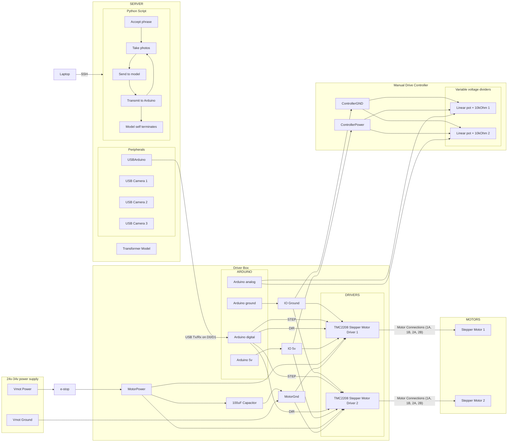

## Scrimpt bot wiring

This is the wiring diagram for scrimp bot hardware. There are five stepper motors (2 sets of 2 muscle motor modules for arms and one for the claw), each with a linear potentiometer for control.

